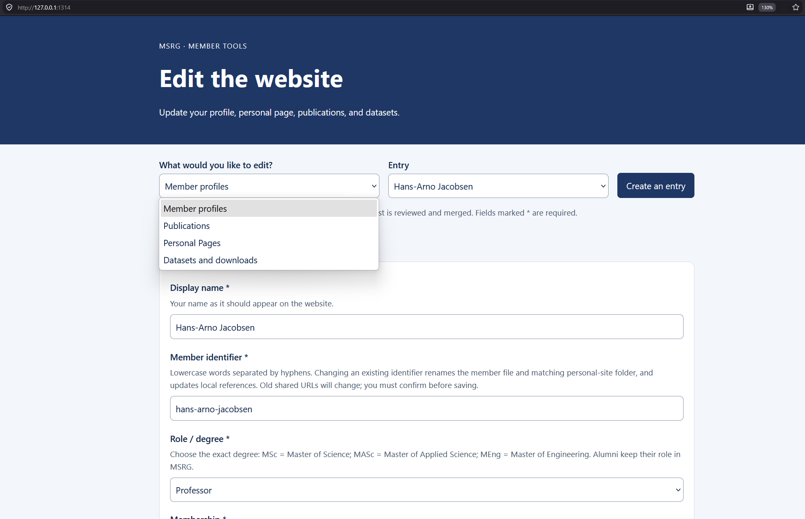

# MSRG website

Live website: https://msrg.github.io/

Once polished, we plan to make the site available at `www.msrg.org` and
`msrg.utoronto.ca` while keeping it hosted on GitHub Pages.

Members propose changes through **pull requests (PRs)**. Thomas reviews and merges
them into `main`, triggering the website's build and deployment.

Ask Thomas (`ttrenty`) on Discord for collaborator access to create branches here,
or fork the repository and submit a PR from your fork.

## Setup

Install [Pixi](https://pixi.sh/latest/installation/) and Git.

Pixi installs the project's pinned Hugo and Python dependencies on first run.

If using a fork, replace the clone URL below with your fork's URL.

```sh
git clone https://github.com/MSRG/msrg.github.io.git
cd msrg.github.io
git switch -c <your-name>/<change-type>/<short-description> # example: ttrenty/fix/homepage-add-news
```

| Command | Purpose |
| --- | --- |
| `pixi run serve` | Preview the website at the URL printed in the terminal. |
| `pixi run editor` | Start the website editor and its local preview. |
| `pixi run check` | Run tests, build, and check internal links. |
| `pixi run build` | Build the website into `public/`. |

## Edit with the website editor

Run the editor from your local website folder:

```sh
pixi run editor
```

Open **http://127.0.0.1:1314** and choose what to edit using the selector at the
top. The editor starts the local website preview automatically; **Ctrl+C** stops both.



| Choose | What you can do |
| --- | --- |
| Member profiles | Update your details, research areas, links, awards, and portrait. |
| Publications | Add papers, abstracts, authors, tags, and related datasets. |
| Personal Pages | Build a page from a template or preview your custom website. |
| Datasets and downloads | Add descriptions, related papers, download links, and files. |

Use **Save changes**, then **Open preview in new tab** to see saved edits.
Saving stays local; [submit a pull request](#check-and-submit-your-pull-request)
to publish. Uploads support up to **20 MB per file** and preserve existing files.

### Edit your member profile

Choose **Member profiles**, select your name or **Create an entry**, and fill in
the form. Use **Upload a portrait** for a JPEG, PNG, or WebP photo, and adjust
the crop alignment if needed.

Avoid giving away your personal email address, as bots regularly scrape the web
for email addresses. Prefer using your university or work email address.

Changing **Member identifier** requires confirmation, renames your member file
and personal-site folder, and updates local references. Shared URLs change;
custom sites may need rebuilding. Editing your display name does not require a
new identifier.

Leave unknown details empty. A confirmed end date moves you to alumni on the
first build after that day, month, or year ends (Toronto time).
Alumni lists show only the end year, but saved dates remain public in the repository.
Once you're an alumni, remove your start date from your profile if you prefer not 
to share that.

### Add or edit publications

Choose **Publications**, select a paper or **Create an entry**, and fill in
the title, year, authors (one per line), venue, paper URL, and publication type.
Add research areas and related datasets where relevant.

Use the published paper URL when available. Include full papers, not abstract-only
conference, poster, or demo entries.

Paste the original abstract into **Abstract**.
Abstracts use **Markdown**, with **LaTeX equations** :

- Text: `*italics*`, `**bold**`, and `[link text](https://example.org)`.
- Inline equations: `$x^2$` or `\(x^2\)`.
- Separate equations: `$$x^2$$` or `\[x^2\]`.

Use `*text*` for italics, not `\textit{text}` outside an equation.
Full LaTeX documents and custom packages are not supported.
Put extra details in **Additional notes**.

The archive shows 100 papers per page; search covers the entire archive.

### Create or edit a personal page

Save your member profile first, then choose **Personal Pages** and your
name. 
You have the choice between multiple templates for your page, select the one that best 
fits your needs.
Write in **Page text**; formatting buttons and uploads help you add content.

For custom HTML, CSS, JavaScript, or a framework, use the
[custom website approach](#build-your-own-site). 
The simple editor using templates does not offer CSS editing.

Your page appears at **`/~your-member-identifier/`**, and your card automatically
gets an **MSRG personal page** icon.

#### Create a shared template

Add a Hugo template in `layouts/personal/` and include any shared styles or scripts
from `assets/`. Add its layout name to the personal template choices in
`data/content_schema.json`, then submit a PR so everyone can select it in the editor.

#### Build your own site

Save your member profile first, then copy your website to **`static/~jane-doe/`**,
starting with `index.html`. Replace `jane-doe` with your member identifier.
Use ordinary HTML/CSS/JS; no Hugo front matter or template is required.
Reference assets relatively (`./style.css`) or under `/~jane-doe/`.

For React, Vue, Svelte, or another framework, export a **static build**, set its
base URL to `/~jane-doe/`, and put the build output in that folder. The workflow
does not build individual framework projects, and GitHub Pages cannot run a
backend. Use hash routing or export an HTML file for each route.

When switching approaches, remove the previous `content/personal/jane-doe/`
template folder or `static/~jane-doe/` custom site; having both fails the build.

### Add or edit datasets and downloads

Choose **Datasets and downloads**, select an entry or **Create an entry**,
and add a title, summary, source / creator, and related publication if available.
Under **Downloads**, add a label and link, or use **Upload a file** beside the
link field. Save, preview the page, and check each download link.

Link to an external repository for datasets larger than **20 MB**.

## Other website content

| What | Where |
| --- | --- |
| Homepage text | `content/_index.md` |
| Research themes | `content/research/` |
| Navigation and site settings | `hugo.yaml` |

Use GitHub's file editor on a branch or fork, then submit a PR.

Edit source files; `public/` is generated. Everything in `content/` and `static/`
may be published. Keep unfinished work on a branch until ready to merge.

## Check and submit your pull request

Preview affected pages on desktop and phone widths. For local changes, run:

```sh
pixi run check
```

Checks reuse cached results when inputs are unchanged. To force a fresh run,
use `pixi run clean-cache`, then `pixi run check`. Check external links manually.

Commit your intended source files and uploads, push your branch, and open a PR
against **`MSRG/msrg.github.io:main`**. Include a brief description, sources for
factual updates where available, and screenshots for visual changes.
Don't commit `public/`, `.pixi/`, or `resources/_gen/`.

GitHub runs **Validate website** for every PR; it must pass before merging.
Merged changes publish after the build and deployment succeed.

### Browser checks

<details>
<summary>Optional automated layout and accessibility checks</summary>

On macOS or Linux, with Node.js 20+ and npm installed, build the site
(`pixi run build`), then run:

```sh
npm install --prefix /tmp/msrg-browser playwright@1.63.0 axe-core@4.13.0
node /tmp/msrg-browser/node_modules/playwright/cli.js install chromium firefox
NODE_PATH=/tmp/msrg-browser/node_modules node scripts/browser_check.cjs public
NODE_PATH=/tmp/msrg-browser/node_modules node scripts/editor_check.cjs
BROWSER_ENGINE=firefox NODE_PATH=/tmp/msrg-browser/node_modules node scripts/browser_check.cjs public
```

Playwright reports missing system dependencies. Site reports and screenshots go
to the printed output directory; editor results appear in the terminal.
The site checks block external services and exclude custom member sites from
the page crawl. Check custom sites, the news widget, and physical phones separately.

</details>

## For maintainers

- **Dependencies:** update `pixi.toml`, run `pixi install`, and commit the updated
  `pixi.lock`. CI uses that same locked environment; PR checks cover Linux,
  macOS, and Windows..
- **Handover:** keep repository administration with MSRG and ensure another
  maintainer can review PRs and manage deployment. The editor runs locally.
- **Content definitions:** [data/content_schema.json](data/content_schema.json)
  supplies the forms, archetypes, validation, and roster role groups. Change fields
  and choices there; research-area choices come from `content/research/`.
